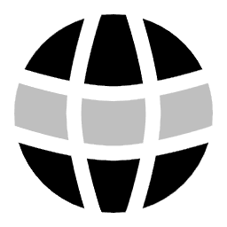

# **👋 Hello there!**

Hello World! I am **Froilan Aquino**, web-developer based on Caloocan City Philippines. I am passionate about things like new emerging technologies like AI Advancements.

As a web developer, I am passionate in using modern JavaScript technologies, particularly React and its potent Next.js framework, which powers this website, to create scalable, maintainable, and smart apps. I use solutions like Supabase for database orchestration integration and Firebase for seamless authentication when it comes to service and backend architecture.

In 2025, I earned my bachelor's degree in information technology, but I'm constantly learning new things outside of the classroom. I actively use websites like YouTube and FreeCode as well as AI-based applications like ChatGPT since I take a very self-directed approach to learning. and Claude to reinforce concepts and broaden my comprehension. Because I'm naturally curious, I usually use Dev.to, Medium, and technical discussions on GitHub and Stack Overflow to research topics. records.

I am currently broadening my technical foundation by studying system-level programming languages such as C and Go, with the aim of deepening my understanding of low-level operations and enhancing my algorithmic thinking. In parallel, I am exploring Java and Kotlin to adopt a native-first approach to mobile development.

## **🤝 Connect with me:**

## **💼 Technical Skills:**

 

 

 

## **📈 Stats:**

